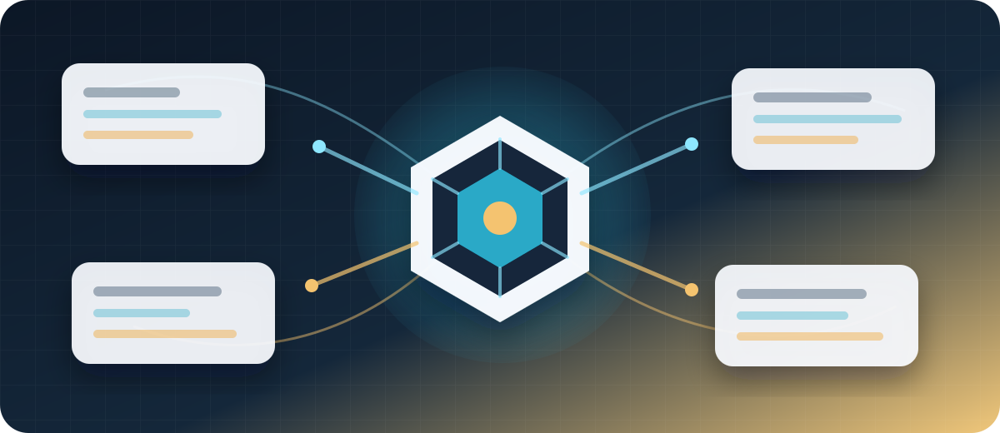
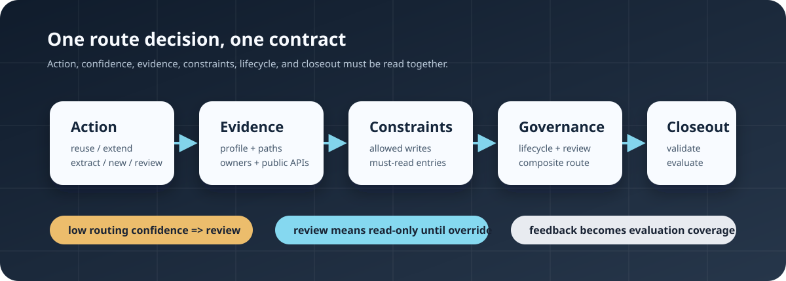
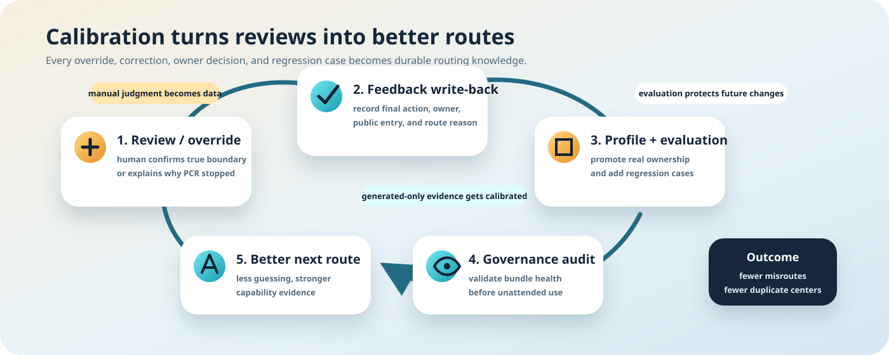

# Project Change Router Skill

English version. The default Chinese README is [README.md](./README.md).

`project-change-router` is an AI coding skill for large repositories, usable from Codex, Claude Code, and DeepSeek Harness. Its goal is not to make agents guess architecture more aggressively. Its goal is to make agents guess less: before editing code, the agent should use a repository-local router bundle to get capability ownership, canonical-root signals, owners, read/write boundaries, reuse risks, and action guidance.

It addresses common structural drift in large projects:

- Agents have limited context and should not spend every task rereading an entire large full-stack repository.
- Agents can lose attention and overfit to local files or similar names.
- Reusable capabilities can be implemented twice, creating parallel implementation centers.
- Code that belongs in a shared lower-level capability can drift into a facade, API route, UI layer, or temporary folder.
- Empty, early, and rebuild repositories have unstable boundaries, so automatic inference can easily freeze temporary structure as architecture fact.

This skill provides a low-token, verifiable, calibratable project direction index and boundary guardrail. It does not replace detailed engineering analysis, and it does not make final architecture decisions for the user. It gives the agent direction, evidence, mandatory constraints, risk reasons, and calibration guidance before implementation starts.



## Core Philosophy

Design principles:

- Guess less before trying to guess better. If evidence is weak, preserve `unknown` and use `execution_gate=blocked` instead of fabricating certainty.
- Prefer profile data over pure heuristics. Real owners, public entries, capability boundaries, and path patterns should be added to `.project-change-router.yaml` over time.
- Prefer structural evidence over name similarity. Paths, owners, public APIs, dependencies, and test bindings are more reliable than semantic similarity.
- Be conservative for early repositories. `seed` and `emerging` repositories should not automatically `extend` or `extract` too easily.
- `review` is not a failure or a write gate. It is an investigation direction in the advisory action layer; `execution_gate` decides whether writing is currently permitted.
- Route output is an integrated contract. The execution gate, safety envelope, and typed findings are mandatory; `action` and unblock suggestions guide the agent but do not replace source-code analysis.
- Results must get better over time. Human overrides, misroutes, profile fixes, and real cases should be written back into feedback and evaluation data.

## Two-Layer Usage Model

PCR output has two layers. Do not interpret them as the same thing.

Mandatory guardrail layer:

- Read `execution_gate.state` first. `pass`, `conditional`, and `blocked` are the only authoritative write states.
- Respect `allowed_write_paths`, `forbidden_write_paths`, and `must_read_before_edit`.
- Identify and protect existing owners, public entries, canonical roots, and dependency direction.
- Do not create a second parallel implementation center when an existing capability may already exist.
- `blocked` forbids product-code writes. `conditional` requires every `required_command` and the bounded envelope. `pass` still cannot exceed that envelope.
- Trace vetoes, unknown evidence, lifecycle findings, high-risk overlap, and provisional boundaries to typed findings and policy rules; never hide them with an action label.

Advisory direction layer:

- `action` is the router's current processing tendency, not a final engineering command.
- `recommended_next_steps`, `safe_next_steps`, `analysis_directions`, `why_not_actions`, and `profile_repair_hints` are unblock directions and investigation prompts.
- `action=review` does not mean the task is impossible and does not automatically mean blocked. It prioritizes evidence gathering, profile repair, source reading, or coordination; `execution_gate` remains authoritative.
- The final implementation plan must still come from real source analysis, dependency tracing, tests, and user confirmation.

## Scope

This skill can:

- Bootstrap a repository-local `project-change-router/` bundle.
- Discover modules, capabilities, owners, public entries, path ownership, and dependency direction.
- Produce a route report from a request and changed path hints, including mandatory guardrails and advisory actions.
- Orchestrate route, freshness, dependency, public API, structure, governance, and reuse checks through `run_change_flow.py`, returning a compact safety envelope by default while persisting full evidence as a content-addressed artifact.
- Normalize gate evidence into traceable typed findings and reduce one authoritative gate through a single versioned policy table.
- Reuse trusted global snapshots through a changed-path-driven forward/reverse dependency closure instead of dropping global invariants.
- Split reuse coverage into independent intra-capability, cross-capability, and new/extract/lifecycle extended channels.
- Run guardrails for duplicate implementation, wrong boundaries, public API bypasses, reversed dependencies, and runtime cycles; TypeScript type-only edges are not misclassified as runtime edges.
- Check freshness from the current commit, a content-derived structure digest, indexed paths, stale entries, and actual changed-path coverage.
- Use exact baselines to stop net-new central-file growth, 800/1200-line threshold crossings, forbidden implementation roots, and second canonical owners.
- Generate `path-to-capability-map.yaml` to expose direct path ownership, shared ownership, and uncovered modules.
- Validate bundles and reports with schemas.
- Run evaluation cases to detect route quality regressions.
- Run governance audits for profile/catalog sync, ownership granularity, contract quality, forbidden density, evaluation coverage, and capability lifecycle metadata.
- Append marked hint blocks during Codex / Claude Code installation and publish the trigger description through the DeepSeek Harness skill catalog so agents are more likely to invoke the skill before feature-level create / modify / delete work.

It should not:

- Replace detailed code reading, dependency tracing, test design, or architecture analysis.
- Treat `action` as a final command that can be executed without analysis.
- Treat `action=review` itself as permission or denial; write authority comes only from `execution_gate`.
- Treat a generated-only bundle as mature architecture fact.
- Reuse or extend a capability only because its name looks similar.
- Create a second implementation center before confirming the canonical root.

## Route Actions

`resolve_entry.py` emits five route actions. These actions are processing guidance and investigation direction, not final architecture commands:

- `reuse`: use an existing capability without modifying its core implementation.
- `extend`: add behavior through an existing shared capability or compatible extension point.
- `extract`: move repeated logic into a shared capability before callers reuse it.
- `new`: create a new isolated capability boundary because no safe reuse target exists.
- `review`: prioritize evidence gathering, profile repair, cross-capability coordination, or human confirmation. It neither grants nor removes write authority.

`review` needs special interpretation. It does not mean the system is useless, it is not a permanent block, and it is not a gate state. In an empty or early repository, a valid route can look like:

```json
{
  "action": "review",
  "routing_confidence": 0.0,
  "routing_confidence_level": "low",
  "decision_confidence": 0.95,
  "decision_confidence_level": "high"
}
```

This means the router has no confidence about which capability should receive the change, but high confidence in its advisory action. Read `execution_gate.state` separately to determine write authority: an unindexed relevant path is `blocked`, while only trusted unrelated and non-expanding historical debt may be `conditional`.

## Repository Stage Policy

The router infers `repo_stage`:

- `seed`: empty or very early repository; default to obvious new boundaries or `review`.
- `emerging`: some structure exists, but capability boundaries are still conservative; provisional boundaries should not become strong reuse targets automatically.
- `structured`: module boundaries are more stable; `reuse`, `extend`, and `extract` are more fully enabled.
- `governed`: routing is primarily driven by profile data, owners, public entries, evaluation, and guardrails.

Capabilities also have stages:

- `provisional`
- `candidate`
- `stable`
- `governed-capability`
- `deprecated`

Do not freeze generated capabilities too early. For early repositories, start with minimal ownership/profile data, then add capabilities, public entries, contracts, test bindings, and evaluation cases as real development confirms the boundaries.

## Integrated Route Report

A route report is not just an action. It is a complete route contract. Core fields include:

- `action`
- `decision_basis`
- `routing_confidence`
- `routing_confidence_level`
- `decision_confidence`
- `decision_confidence_level`
- `primary_capability`
- `primary_capability_stage`
- `secondary_capabilities`
- `candidate_capabilities`
- `required_reads`
- `required_checks`
- `recommended_next_action`
- `recommended_next_steps`
- `why_not_actions`
- `confidence_reasons`
- `veto_reasons`
- `positive_signals`
- `negative_signals`
- `risk_signals`
- `authorization_context`
- `route_fingerprint`
- `runtime_identity`
- `typed_findings`
- `execution_gate`
- `gate_shadow`
- `must_read_targets`
- `inventory_targets`
- `unresolved_read_targets`
- `authorization_request`

The seven governance output groups are first-class fields in the same route report, not an external add-on:

- post-`review` handling: `block_reason`, `missing_evidence`, `analysis_directions`, `safe_next_steps`, `suggested_questions`, `override_requirements`
- write constraints: `allowed_write_paths`, `forbidden_write_paths`, `must_read_before_edit`
- profile repair direction: `profile_repair_hints`, plus `repair_suggestions` in governance audit reports
- post-change closeout: `post_change_closeout`
- delete, merge, and deprecation governance: `capability_lifecycle_action`
- cross-stack composite routing: `composite_route`
- real regression capture: `evaluation_regression_hints`

See [references/governance-outputs.md](./references/governance-outputs.md) for the detailed contract.



### 0.4 Execution Gate and Evidence Model

PCR 0.4 separates routing advice from write authority:

| Field | Meaning |
| --- | --- |
| `action` | `reuse / extend / extract / new / review`; engineering investigation and handling direction only |
| `execution_gate.state=pass` | Relevant evidence is complete and no task-relevant blocker exists; the read/write envelope still applies |
| `execution_gate.state=conditional` | Only proven unrelated or non-expanding trusted historical debt remains; run prerequisites and keep writes bounded |
| `execution_gate.state=blocked` | Unknown/incomplete evidence, relevant P0/P1 findings, owner/canonical/public API/lifecycle/high-risk issues, or a hard invariant conflict exists |

The gate performs no repository scan and no second routing pass. One versioned policy table deterministically reduces schema-valid typed findings. Every finding carries a stable ID, origin, severity, invariant class, delta, task relevance, evidence status, policy rule, paths/capabilities, relevance trace, and evidence digest.

`gate_shadow` retains the old/new gate comparison for diagnostics only. In 0.4, `execution_gate.authoritative=true`; the legacy gate no longer grants or denies writes. `output_complete=false` or schema-v1 input that cannot provide required precision must produce an unknown/incomplete finding and block rather than receive optimistic defaults.

Unified entry point:

```powershell
python scripts/run_change_flow.py --repo <repo-root> --request "Add invoice refund support" --changed-path services/billing/refund.py --format compact-json
```

Default compact output always retains the non-projectable safety envelope: `execution_gate`, `veto_reasons`, `allowed_write_paths`, `forbidden_write_paths`, `unknown_evidence`, `artifact_path`, `artifact_digest`, and `output_complete`. The complete route, checks, findings, and cache/baseline evidence are stored in a content-addressed artifact. Use `--format full-json` for the full report or `--format artifact-reference` for the minimum reference. `--field` can add ordinary fields; `--exclude-field` cannot hide safety fields.

## Installation

Python requirement:

- Python `>= 3.10`
- DeepSeek Harness plugin validation follows Harness's current Node requirement: `^22.19.0 || >=24.0.0`; filesystem-only installation does not start an additional Node process

Install dependencies:

```powershell
pip install -r requirements.txt
```

Or install in development mode:

```powershell
pip install -e .[dev]
```

Install for Codex, Claude Code, and DeepSeek Harness:

```powershell
python scripts/install_skill.py --target all --inject-hints
```

Install paths:

- Codex: `%USERPROFILE%\.codex\skills\project-change-router`
- Claude Code: `%USERPROFILE%\.claude\skills\project-change-router`
- DeepSeek Harness: `$DSH_HOME/skills/project-change-router`, defaulting to `~/.dsh/skills/project-change-router` when `DSH_HOME` is unset

`--inject-hints` appends marked blocks only for Codex and Claude Code, which need persistent rule-entry reminders. It never rewrites whole files:

- Codex: appends to `~/.codex/AGENTS.md`
- Claude Code: appends to `~/.claude/CLAUDE.md`

This is soft enforcement that reminds the agent to invoke the skill before feature-level create / modify / delete work. It is not a background daemon and it does not bypass the conversation trigger model.

DeepSeek Harness publishes PCR's `name` and `description` through its skill catalog and supports explicit `/project-change-router` tokens in user messages, so no Harness-wide prompt document needs to be rewritten.

Compatibility: `--target both` retains its existing meaning and installs only Codex plus Claude Code; `--target deepseek` installs only Harness; `--target all` installs all three. For a project-local Harness installation, use the repository `.dsh` directory as the home:

```powershell
python scripts/install_skill.py --target deepseek --dsh-home <repo-root>/.dsh
```

Harness's native filesystem provider then discovers `<repo-root>/.dsh/skills/project-change-router/SKILL.md`. Harness also supports `<repo-root>/.agents/skills`, `~/.agents/skills`, and custom skill roots, while this installer intentionally defaults to the official `DSH_HOME` location.

### Install as a DeepSeek Harness GitHub Plugin

The root `package.json` declares a `dsh.bundle`. Its Cordis provider reads the root `SKILL.md` and exposes the same resource directory, so there is no second prompt source. Pin a commit SHA when installing:

```powershell
dsh plugin --profile <profile-name> add github:WeirdSky924/project-change-router-skill#<commit-sha>
dsh --profile <profile-name> --dump-config
```

The bundle is native ESM with no TypeScript build, `prepare` script, or install-time code execution allowance. Project `.dsh/skills` and user filesystem skills have a higher Harness rank than the bundled provider, preserving the official local-override behavior.

Remove the profile plugin with:

```powershell
dsh plugin --profile <profile-name> remove project-change-router-skill
```

Harness community discovery uses the `dsh-plugin` topic on public GitHub repositories. Before release, configure searchable topics such as `dsh-plugin`, `deepseek-harness`, `agent-skills`, and `coding-agent`. DeepSeek Harness remains a developer preview, so rerun the provider smoke and installation validation after upgrading between Harness preview releases.

The installer uses staging, a recursive payload hash, recursive Python compilation, governance API probes, and atomic replacement. It replaces the old skill only after the new copy passes all checks, and restores the old copy on failure. This prevents top-level scripts, `router_support`, schemas, documentation, or the DSH provider from being installed as a mixed version.

The source checkout and destination must be different paths. If this Git checkout already lives at any target's `skills/project-change-router` path, do not install over itself; use a separate checkout to install multiple targets, or install only the other targets. `--verify-only` requires the trusted manifest created by an atomic installation. A legacy copy without that manifest must be reinstalled once before hash verification is meaningful.

## Safely Upgrade an Existing PCR Installation

The global skill and a repository bundle are separate layers:

- The global skill lives under `~/.codex/skills/project-change-router`, `~/.claude/skills/project-change-router`, or `~/.dsh/skills/project-change-router` and contains scripts and workflow instructions.
- The repository bundle lives under `<repo-root>/project-change-router/` and contains that project's long-lived capability, owner, path-map, feedback, and evaluation data.

Updating the global skill neither requires nor authorizes rebuilding repository bundles. Use this upgrade sequence:

1. Update this skill source repository to the version you intend to install.
2. Run the atomic installer:

```powershell
python scripts/install_skill.py --target all --inject-hints
```

3. Verify the installed Codex, Claude Code, and DeepSeek Harness copies, including file hashes and reuse-engine API compatibility:

```powershell
python scripts/install_skill.py --target all --verify-only
```

4. For a repository that has used PCR for a long time, run read-only compatibility checks only:

```powershell
python <new-skill-root>\scripts\validate_router_bundle.py --repo <existing-repo> --format json
python <new-skill-root>\scripts\check_bundle_governance.py --repo <existing-repo> --format json
python <new-skill-root>\scripts\check_index_freshness.py --repo <existing-repo> --changed-path <known-path> --comparison-commit <trusted-base-commit> --format json
python <new-skill-root>\scripts\check_deps.py --repo <existing-repo> --comparison-commit <trusted-base-commit> --format json
python <new-skill-root>\scripts\check_public_api.py --repo <existing-repo> --comparison-commit <trusted-base-commit> --format json
python <new-skill-root>\scripts\check_structure.py --repo <existing-repo> --comparison-commit <trusted-base-commit> --format json
python <new-skill-root>\scripts\run_evaluation.py --repo <existing-repo> --format json
python <new-skill-root>\scripts\check_reuse.py --repo <existing-repo> --changed-path <known-path> --strict-completeness --format json
python <new-skill-root>\scripts\run_change_flow.py --repo <existing-repo> --request "Compatibility check only" --changed-path <known-path> --format compact-json
```

5. Continue using the existing bundle after those checks. Do not run `bootstrap_router.py` or `rebuild_index.py` merely because the installed skill changed.

Compatibility guarantees:

- The new skill continues to read bundle schema v1.
- Version 0.4 uses architecture governance API v2 plus typed-finding, gate, change-flow, and authorization API v1 while preserving reuse engine API v2.
- Every current report carries one `runtime_identity` binding skill version, Git commit when available, installed payload digest, and schema/API/policy/parser versions. Cache, baseline, finding, authorization, and artifact identity all bind to it.
- New evaluation fields in schema v1 remain optional. Safe runtime defaults are read in memory and are not written back to old YAML during compatibility checks; missing or disabled evaluation enforcement remains `review_only` rather than granting write authority.
- When schema v1 cannot supply the precision required for typed findings, relevance closure, or a trusted baseline, 0.4 emits `unknown` and keeps the execution gate blocked. It does not fabricate precision or write new fields into the old bundle.
- `normal` requires at least 30 real cases named by `curated_case_ids`, the complete six-category calibration matrix, explicit capability expectations, and a valid attestation. Thresholds may only be tightened; generated or legacy cases without provenance remain `review_only`.
- If an old bundle lacks `reuse_scan_scope`, `reuse_scan_runtime`, or `reuse_scan_retention`, code defaults apply without writing those defaults back to YAML.
- New fingerprints, checkpoints, canonical reports, diagnostics, flow artifacts, baselines, and authorization manifests live in the user cache by default. They do not modify the target repository or require a new `.gitignore` entry.
- The installer does not search project directories and does not modify profiles, manual feedback, evaluation cases, owners, or lifecycle metadata.
- An incorrect repository-wide `** -> concrete capability` entry in an old bundle cannot expand a reuse scan when a more specific mapping exists. Governance audit still reports that metadata debt.
- Read compatibility does not mean every historical report satisfies the current output schema. Regenerate reports that are kept as current examples or CI fixtures.

Run rebuild only when repository structure, ownership, public entries, or capability boundaries actually changed. Before rebuilding, migrate human truth written directly into generated YAML into `.project-change-router.yaml`, and preserve manual feedback, curated evaluation cases, and lifecycle data. Use the [existing-bundle update prompt](./examples/agent-workflows/update-existing-router-bundle-prompt.md) for that controlled refresh.

This installer output confirms that the upgrade did not touch any repository bundle:

```text
repository_bundles_modified=0
```

## Installation Validation

Validate skill structure:

```powershell
python <codex-home>\skills\.system\skill-creator\scripts\quick_validate.py <codex-home>\skills\project-change-router
```

Expected output:

```text
Skill is valid!
```

Full smoke test in this repository:

```powershell
python -m pytest tests/test_router_core.py -q
python scripts/bootstrap_router.py --repo . --format json
python scripts/rebuild_index.py --repo . --format json
python scripts/validate_router_bundle.py --repo . --format json
python scripts/check_bundle_governance.py --repo . --format json
python scripts/check_index_freshness.py --repo . --format json
python scripts/check_deps.py --repo . --format json
python scripts/check_public_api.py --repo . --format json
python scripts/check_structure.py --repo . --format json
python scripts/run_evaluation.py --repo . --format json
python scripts/check_reuse.py --repo . --changed-path scripts/router_support/owner_identity.py --strict-completeness --format json
python scripts/install_skill.py --target codex --codex-home <temporary-codex-home>
python scripts/install_skill.py --target codex --codex-home <temporary-codex-home> --verify-only
```

A fresh bootstrap deliberately keeps PCR in `review_only` until the evaluation set has enough real cases, the complete calibration matrix, and a current attestation. Therefore `run_evaluation.py` returns exit code `1` with `status=fail`, `enforcement_mode=review_only`, and an `evaluation_cases_not_curated` reason in this smoke flow. CI asserts that exact safety result instead of weakening the threshold or treating generated seed cases as production calibration evidence.

## Onboard a Target Repository

First onboarding for a target repository:

```powershell
python <skill-root>\scripts\bootstrap_router.py --repo <repo-root> --format json
```

This creates:

```text
<repo-root>/project-change-router/
```

The bundle contains:

- `router-config.yaml`
- `references/capability-catalog.yaml`
- `references/module-map.yaml`
- `references/ownership.yaml`
- `references/path-to-capability-map.yaml`
- `references/change-rules.yaml`
- `references/exception-registry.yaml`
- `references/evaluation-set.yaml`
- `schemas/`
- `reports/`

Bootstrap automatically adds this entry to the target repository `.gitignore`:

```text
project-change-router/
```

The target repository root can include a profile override file:

```text
.project-change-router.yaml
.project-change-router.yml
project-change-router.profile.yaml
project-change-router.profile.yml
```

These names are selected by canonical, legacy, and skill-fallback priority; they are not merged. Exactly one file may exist at the selected level. A `.yaml`/`.yml` sibling conflict fails closed until one source of truth remains.

Profiles can declare:

- capability-to-path mappings
- ownership rules
- explicit capability ownership with one real primary owner and distinct reviewers
- module overrides
- public entries
- contracts
- forbidden patterns
- lifecycle metadata
- evaluation cases
- risk rules
- exact dependency/cycle debt baselines
- central-growth, forbidden-root, and exclusive-owner structure rules

Minimal profile templates are in [examples/profiles/README.md](./examples/profiles/README.md).

## Daily Use

Explicit invocation in Codex:

```text
Use $project-change-router to resolve the correct capability entry for this change.
```

Explicit invocation in Claude Code:

```text
/project-change-router resolve the correct capability entry for this change
```

DeepSeek Harness uses the same whitespace-bounded slash invocation, or the model can load PCR from the published skill catalog when the task matches its description:

```text
/project-change-router resolve the correct capability entry for this change
```

Prefer the unified flow for one route plus its governed checks:

```powershell
python scripts/run_change_flow.py --repo <repo-root> --request "Add invoice refund support" --changed-path services/billing/refund.py --format compact-json
```

It can read a request file. Use the compatible `resolve_entry.py` separately only for focused route diagnostics:

```powershell
python scripts/run_change_flow.py --repo <repo-root> --request-file request.md --changed-path services/billing/refund.py --format artifact-reference --output flow-report.json
python scripts/resolve_entry.py --repo <repo-root> --request-file request.md --changed-path services/billing/refund.py --format json --output route-report.json
```

Execution rules after resolution:

- If `execution_gate.state=blocked`: do not write product code; resolve decisive findings and unknown evidence through required commands or a source-backed authorization workflow where policy permits it.
- If `execution_gate.state=conditional`: run every required command and write only inside allowed paths. Conditional applies only to proven unrelated or non-expanding trusted historical debt.
- If `execution_gate.state=pass`: complete precise must-reads and proceed inside the envelope.
- `action=review` prioritizes investigation, profile repair, or coordination; it does not block by itself. No other action can override the gate.
- If `action=reuse`: treat it as a reuse tendency; read `must_read_before_edit` and `required_reads` first, and do not modify the core implementation.
- If `action=extend`: treat it as an extension tendency; write only inside `allowed_write_paths` and avoid bypassing public entries.
- If `action=extract`: treat it as an extraction tendency; confirm repeated surfaces, callers, and tests before extracting a shared capability.
- If `action=new`: treat it as a new-boundary tendency; name an isolated boundary first and do not create a second parallel center next to an existing capability.

## Codex / Claude Code / DeepSeek Harness Prompt

Recommended text for unattended plans or long-running tasks:

```text
Before any feature-level create, modify, delete, merge, deprecate, or migration work, invoke project-change-router and run run_change_flow.py for the target repository. Use PCR as a direction index and guardrail system, not as an automatic architecture decision engine.

Read execution_gate before action. execution_gate.state is the authoritative write decision. For blocked, do not write product code. For conditional, run every required_command and keep writes inside the bounded envelope. For pass, still obey the envelope and precise must-read targets.

Treat action, including action=review, as advisory direction only. Use recommended_next_steps, safe_next_steps, analysis_directions, profile_repair_hints, and why_not_actions for source analysis and user-confirmed decisions; never turn action into a second gate.

Never ignore veto_reasons, unknown_evidence, canonical owner/root, public entry, lifecycle findings, duplicate risk, or unresolved closure evidence. Trace them to typed findings and policy rules. Bounded or incomplete evidence cannot prove absence.

Do not create a second implementation center when an existing capability or canonical root may exist. If routing evidence is weak, repair the profile or ask for confirmation instead of guessing.

Use must_read_targets by path, symbol, and content digest. Treat directories only as inventory_targets. Run unresolved_read_targets queries and keep the target unresolved until a unique implementation is proven.

For an override, create an authorization_request and require explicit user confirmation before creating a grant. Bind it to task, paths, owner, route, pre-change snapshot, mutation envelope, runtime/policy identity, expiry, and use count. Never revive a consumed or invalidated grant.

After routed changes, execute post_change_closeout, rerun the affected flow/checks, and record feedback/evaluation cases after review, override, lifecycle change, false route, or routing correction.

Keep full diagnostics in the content-addressed artifact. In the main context retain the compact safety envelope, decisive delta, exact reads, and next command. Never hide a safety-envelope field through projection.
```

A fuller copyable version is available in [examples/agent-workflows/unattended-plan-prompt.md](./examples/agent-workflows/unattended-plan-prompt.md).

Upgrading the skill does not require an automatic bundle refresh. Use [examples/agent-workflows/update-existing-router-bundle-prompt.md](./examples/agent-workflows/update-existing-router-bundle-prompt.md) only when read-only compatibility checks prove that the index is stale or repository boundaries changed. The controlled refresh must preserve human-authored profiles, feedback, evaluation cases, and lifecycle data.

## Lifecycle Command Table

| Scenario | Command |
| --- | --- |
| First repository onboarding | `python scripts/bootstrap_router.py --repo <repo-root> --format json` |
| Major repository structure change | `python scripts/rebuild_index.py --repo <repo-root> --format json` |
| Unified route, checks, and closeout plan | `python scripts/run_change_flow.py --repo <repo-root> --request "<request>" --changed-path <path> --format compact-json` |
| Resolve route before editing | `python scripts/resolve_entry.py --repo <repo-root> --request "<request>" --changed-path <path> --format json` |
| Create/grant/consume authorization | `python scripts/manage_authorization.py --repo <repo-root> <request|grant|consume|inspect> ...` |
| Pre-commit bundle validation | `python scripts/validate_router_bundle.py --repo <repo-root> --format json` |
| Check duplicate implementation | `python scripts/check_reuse.py --repo <repo-root> --changed-path <path> --format json` |
| Check dependency direction | `python scripts/check_deps.py --repo <repo-root> --format json` |
| Check public API boundaries | `python scripts/check_public_api.py --repo <repo-root> --format json` |
| Check central growth, file size, and exclusive owners | `python scripts/check_structure.py --repo <repo-root> --format json` |
| Check index freshness | `python scripts/check_index_freshness.py --repo <repo-root> --format json` |
| Routing governance health check | `python scripts/check_bundle_governance.py --repo <repo-root> --format json` |
| Route quality regression evaluation | `python scripts/run_evaluation.py --repo <repo-root> --format json` |
| Manual feedback write-back | `python scripts/sync_feedback.py --repo <repo-root> --feedback-file feedback.json --format json` |

## Architecture Governance

PCR 0.4 adds typed findings, incremental global evidence, trusted baselines, and an authoritative execution gate to the existing regression guardrails:

- The Python and TypeScript/JavaScript import graph separates runtime from type-only edges and reports runtime cycles, resolver diagnostics, and dependency direction.
- `architecture_baseline` records exact existing debt. Registered debt can remain visible without blocking, while new findings or net growth fail. It is never a wildcard exemption.
- `central_growth_baseline` prevents composition roots, global gateways, top-level controllers, and other central owners from absorbing more domain implementation.
- `forbidden_implementation_roots` prevents new production implementations under legacy, compatibility, generated, or otherwise non-canonical roots.
- `exclusive_source_owners` prevents profile-declared protected implementation tokens outside their canonical owner. Raw transports, caches/stores, or DTO duplicates that use unrelated identifiers still require repository-specific import, identifier, or AST gates.
- `generated_output_baseline` is limited to the seven fixed PCR reference artifacts during canonical-profile migration and binds the repository's unique active `.project-change-router.yaml` or `.project-change-router.yml`. The rule source and every non-null artifact provenance value must be a full immutable SHA for that repository's object format. An artifact may predate the rule source, but it must be an ancestor of both the rule source and the current rebuild source; null mode must remain null. Pinned digests project out only top-level `generated_at`, `source_commit`, and explicitly listed capability-catalog generator clocks. `path_to_capability_map.path_index[*].code_file_count` remains in the pinned digest; it is treated as comparison-only rebuild volatile only for the same `path_pattern` when both old and new values are valid non-negative integers, preventing ordinary repository file-count changes from producing false positives. The actual pinned count remains protected by its digest, canonical UTF-8 bytes, and line count, so a missing value, type drift, or tracked-artifact tamper still fails. After verification, ordinary `rebuild_index.py` preserves all seven tracked refs and refreshes only `router-config.yaml`, schemas, and `latest.json`; failure writes no bundle or report. The evaluation attestation is rebound to the effective persisted combination of new config plus pinned refs. Initial pinning requires `--initialize-generated-output-baseline <fingerprint>` on either `check_structure.py` or `rebuild_index.py`; profile prose cannot authorize itself. While a pin is active, malformed, or removed only in the worktree, `bootstrap_router.py` cannot clear the protected refs.
- Every stable capability needs one explicit `capability_ownership` record with a real primary owner and distinct reviewer, lifecycle metadata, contracts/test bindings, and positive plus boundary evaluation coverage. Generated owner labels, `UNKNOWN`, unassigned, missing, duplicate, and provisional owners cannot authorize unattended writes.
- Freshness checks the current commit, content-derived structure digest, stale entries, indexed paths, report field shapes, and changed-path coverage. The global report continues to expose all debt; the route gate then classifies the delta against the current capability's forward and reverse dependency closure as `task_local_new`, `baseline_unchanged`, or `unknown`. Relevant and unresolved changes still block, while proven debt in another capability no longer turns a local safe change into repository-wide `forbidden=["**"]`. Canonical config, the seven references, and schemas remain digest inputs even when bundle `ignore_paths` match them; only self-referential `latest.json` is exempt. Explicit `--changed-path` values are unioned with real paths from the indexed source through `HEAD`, staged, unstaged, untracked, and deleted state.
- Every route report carries an `authorization_context` and `route_fingerprint` bound to the source commit, structure digest, routing truth, changed paths, capabilities, action, override requirements, and write envelope. Manual feedback must return the original fingerprint. Changed input or report content invalidates authorization, and the manifest cannot recreate consumed authority.
- Missing, stale, or below-threshold evaluation attestation keeps PCR in `review_only`; a correct capability match alone does not prove that the action or write authority is reliable.

Baseline existing debt exactly, stop new growth first, and reduce the baseline in later governance work. Do not gain a pass by enlarging ignore patterns, weakening rules, or fabricating evaluation cases. See [references/architecture-governance.md](./references/architecture-governance.md) for field contracts, exit metadata, and the recommended CI sequence.

Flow evidence baselines use a stricter provenance contract. A first scan, dirty worktree, or bounded/incomplete result can only be a `candidate_snapshot` or `unknown`. Only a complete candidate on a clean commit, a trusted CI snapshot, or an exact user-accepted fingerprint can become a `trusted_baseline`. Baselines bind commit, profile, bundle, structure, indexed paths, scope, tool/runtime, policy, and evidence digests. Identity changes invalidate them, and superseded versions move to history instead of being overwritten. Deltas explicitly report new, expanded, unchanged, reduced, and resolved findings.

## Reuse Scan Runtime

`check_reuse.py` is now a capability-scoped bounded scanner, not a repository-wide semantic search engine. A changed-path run follows this pipeline:

```text
changed paths
  -> path map / owner / key files / related tests / test bindings
  -> primary + dependency capability scope
  -> native fingerprint candidate retrieval
  -> pair deduplication and Top-K
  -> isolated-worker exact comparison
  -> canonical / checkpoint / diagnostic reports
```

Key behavior:

- A changed path outside `modules[].path` is still included when it is a key file, index source, related test, test binding, or exact path-map entry.
- An unresolved capability returns `completion_status=incomplete`; the scanner never silently falls back to the full repository.
- When a specific mapping exists, a repository-wide `** -> concrete capability` entry from an old bundle cannot expand the scope.
- Exact path-map ownership takes precedence over broad module ownership. A second owner is retained only when the same exact path explicitly declares shared ownership.
- Dependency scope expands one hop only across observed runtime import edges. TypeScript type-only edges and transitive dependencies do not expand the scan.
- Import parser or resolver diagnostics make evidence incomplete; they are never treated as a clean dependency graph.
- Test paths prefer same-capability related tests, test bindings, and owner surfaces instead of every product module.
- A file pair is computed once. If multiple capabilities reference it, one finding merges all capability IDs and retains the strongest severity.
- Large pairs that cannot use exact comparison but have strong fingerprints produce a P2 `duplicate-fingerprint-candidate`. It requires targeted source analysis and is not exact duplicate proof.
- Every flow reports independent `intra_capability`, `cross_capability`, and `extended` channels. `new`, `extract`, and lifecycle requests require extended coverage; shared/canonical surfaces still trigger cross-capability checks.
- Each channel carries its own scope digest, coverage, budget, completion status, skipped reasons, and evidence digest. If any required channel is bounded or incomplete, the global duplicate conclusion is only `not_proven`.

### Fingerprint Cache

The cache uses Python's standard-library `sqlite3` and `hashlib`. It stores file identity, size, normalized length, token sketch, content digest, and algorithm version, but never complete normalized source. A warm scan reuses unchanged owner fingerprints and reads full text only for Top-K exact candidates.

The default runtime directory is outside the repository:

- Windows: `%LOCALAPPDATA%\project-change-router\repositories\<repo-key>\`
- Linux/macOS: `$XDG_CACHE_HOME/project-change-router/repositories/<repo-key>/`, falling back to `~/.cache/...`

Cache modes are `auto`, `read-only`, `off`, and `rebuild`. Configure them with `--cache-mode` or profile/change-rules data.

### Timeout and Cancellation

The CLI runs scans in an isolated child process:

- The soft timeout stops dispatching comparisons and writes a checkpoint.
- The hard timeout terminates a worker still blocked in one full-text comparison.
- `Ctrl+C` uses the same cancellation, termination, and canonical-report finalization path.
- The hard timeout is always at least one second later than the soft timeout.

CLI values override profile/change-rules values:

```powershell
python scripts/check_reuse.py --repo <repo-root> --changed-path <path> `
  --timeout-seconds 60 --hard-timeout-seconds 75 `
  --cache-mode auto --diagnostics auto --format json
```

Count budgets remain available through `--max-candidate-files`, `--max-owner-files`, `--max-comparisons`, `--max-file-bytes`, and `--top-k-owner-files`.

### Report Classes

- `canonical`: final machine contract for agents and CI; emitted for complete, bounded, timed-out, cancelled, and errored runs.
- `checkpoint`: recoverable partial state; deleted after complete runs and retained temporarily for non-complete runs; never a final decision.
- `diagnostic`: scope, cache, phase timing, and rejection evidence; `auto` persists it only for slow or non-complete scans.

Always read these fields together:

```text
result_status      = pass | warn | fail
completion_status  = complete | bounded | incomplete | timeout | cancelled | error
evidence_complete  = true | false
```

Typical meanings:

| Scenario | result_status | completion_status |
| --- | --- | --- |
| Target scope completed without a blocker | `pass` | `complete` |
| Target scope completed with an exact P1 duplicate | `fail` | `complete` |
| No P0/P1 before a budget or large-file limit | `warn` | `bounded` |
| Changed path ownership is unresolved | `warn` | `incomplete` |
| Worker exceeds its deadline | `warn` | `timeout` |
| A P1 was found before cancellation | `fail` | `cancelled` |

Only `completion_status=complete` with `evidence_complete=true` supports the statement that the target capability scope was fully checked. It still says nothing about unrelated capabilities and does not replace source analysis.

A changed-path report identity uses routing truth, target content, and the `source_fingerprint_digest` of owner/candidate files that actually participated in the scan. Unrelated worktree files no longer churn canonical-report deduplication, while any source used by the decision still invalidates the digest when it changes.

### Automatic Retention and Cleanup

Canonical artifacts are semantically deduplicated by input, scope, evidence, budget, and findings. P0/P1 reports are pinned. Defaults retain 90 days/500 canonical reports, 7 days of checkpoints, 3 days/200 diagnostics, 50,000 fingerprints, and 512 MiB per repository runtime.

Cleanup deletes only artifacts registered in SQLite and located under the resolved runtime root. It never glob-deletes repository files. Run cleanup independently with:

```powershell
python scripts/check_reuse.py --repo <repo-root> --cleanup-only --format json
```

Default exit codes preserve older automation: `0` without P0/P1, `1` for P0/P1, `2` for timeout/error, and `130` for cancellation. Under `--strict-completeness`, `bounded` and `incomplete` also return `2`. Automation should prefer JSON fields over the exit code alone.

See [references/reuse-scan-runtime.md](./references/reuse-scan-runtime.md) for the complete configuration and behavior contract.

## Governance Audit

`check_bundle_governance.py` checks whether the bundle is merely runnable or healthy enough for long-term routing governance.

It checks:

- profile-declared capabilities are present in the catalog.
- change rules do not reference unknown capabilities.
- generated-only capabilities are not excessive.
- the path-to-capability map has no uncovered modules or multi-capability conflicts.
- ownership rules are not too broad or too file-grained.
- contracts are not missing, too short, or too long.
- forbidden pattern density is sufficient for large capabilities.
- dependency priority covers all capabilities.
- the evaluation set covers profile-backed capabilities.
- deprecated capabilities include `superseded_by`, `deprecation_date`, and `migration_note`.
- stable capabilities have a non-provisional owner, a distinct reviewer, lifecycle metadata, and positive plus boundary evaluation coverage.

Default exit behavior:

- P0: fail.
- P1: warn by default, fail under `--strict`.
- P2: maintenance recommendation, not blocking.

## Manual Feedback and Continuous Calibration

### Bounded Authorization Manifest

An `authorization_request` is only a draft bound to the current task/path/owner/route/pre-change snapshot/mutation envelope; it cannot create authority. After explicit user confirmation, record a grant with `manage_authorization.py grant`. Grants default to one use and 24-hour expiry; explicit bounded grants can allow at most 100 uses and 30 days. Every transition enters a digest-chained audit event. Any context, runtime/policy, or mutation change invalidates the grant, and a consumed, expired, invalidated, or rejected grant can never revive from matching input.

```powershell
python scripts/manage_authorization.py --repo <repo-root> request --route-report <full-flow-report.json>
python scripts/manage_authorization.py --repo <repo-root> grant --request-id <request-id> --authorization-source user --confirmation "<exact confirmation>"
python scripts/manage_authorization.py --repo <repo-root> consume --grant-id <grant-id> --route-report <current-full-flow-report.json>
python scripts/manage_authorization.py --repo <repo-root> inspect --grant-id <grant-id>
```



When a human confirmation, override, misroute, capability merge, deprecation, or profile correction happens, record feedback:

```powershell
python scripts/sync_feedback.py --repo <repo-root> --feedback-file feedback.json --format json
```

Example:

```json
{
  "decision_id": "route-...",
  "final_action": "review",
  "final_capability": "billing",
  "confirmed_public_entry": "services/billing/__init__.py",
  "confirmed_owner": "billing-team",
  "profile_update_recommended": true,
  "notes": "Human-confirmed correction"
}
```

Promote real misroutes into evaluation cases. Do not fix a rule without adding a regression sample.

Copyable samples:

- [examples/feedback/manual-route-correction.json](./examples/feedback/manual-route-correction.json)
- [examples/evaluation/route-regression-cases.yaml](./examples/evaluation/route-regression-cases.yaml)

## Real-Repository Calibration Reference

An anonymized real-structure calibration reference is available:

- [examples/calibration/README.md](./examples/calibration/README.md)
- [examples/calibration/anonymized-structure.md](./examples/calibration/anonymized-structure.md)
- [examples/calibration/anonymized-profile.yaml](./examples/calibration/anonymized-profile.yaml)
- [examples/calibration/anonymized-module-map.yaml](./examples/calibration/anonymized-module-map.yaml)
- [examples/calibration/anonymized-route-cases.yaml](./examples/calibration/anonymized-route-cases.yaml)
- [examples/calibration/anonymized-feedback.json](./examples/calibration/anonymized-feedback.json)

These samples show how a large full-stack project can turn real modules, owners, public entries, route cases, and feedback into reusable governance data.

## Example Files

Agent workflow examples:

- [examples/agent-workflows/README.md](./examples/agent-workflows/README.md)
- [examples/agent-workflows/unattended-plan-prompt.md](./examples/agent-workflows/unattended-plan-prompt.md)
- [examples/agent-workflows/update-existing-router-bundle-prompt.md](./examples/agent-workflows/update-existing-router-bundle-prompt.md)

Profile templates:

- [examples/profiles/early-repo.project-change-router.yaml](./examples/profiles/early-repo.project-change-router.yaml)
- [examples/profiles/python-monorepo.project-change-router.yaml](./examples/profiles/python-monorepo.project-change-router.yaml)
- [examples/profiles/ts-workspace.project-change-router.yaml](./examples/profiles/ts-workspace.project-change-router.yaml)
- [examples/profiles/mixed-repo.project-change-router.yaml](./examples/profiles/mixed-repo.project-change-router.yaml)
- [examples/profiles/skill-repo.project-change-router.yaml](./examples/profiles/skill-repo.project-change-router.yaml)
- [examples/profiles/reuse-runtime.project-change-router.yaml](./examples/profiles/reuse-runtime.project-change-router.yaml)

Feedback and evaluation samples:

- [examples/feedback/manual-route-correction.json](./examples/feedback/manual-route-correction.json)
- [examples/evaluation/route-regression-cases.yaml](./examples/evaluation/route-regression-cases.yaml)

Bundle samples:

- [examples/bundle/router-config.yaml](./examples/bundle/router-config.yaml)
- [examples/bundle/references/capability-catalog.yaml](./examples/bundle/references/capability-catalog.yaml)
- [examples/bundle/references/module-map.yaml](./examples/bundle/references/module-map.yaml)
- [examples/bundle/references/ownership.yaml](./examples/bundle/references/ownership.yaml)
- [examples/bundle/references/path-to-capability-map.yaml](./examples/bundle/references/path-to-capability-map.yaml)
- [examples/bundle/references/change-rules.yaml](./examples/bundle/references/change-rules.yaml)
- [examples/bundle/references/exception-registry.yaml](./examples/bundle/references/exception-registry.yaml)
- [examples/bundle/references/evaluation-set.yaml](./examples/bundle/references/evaluation-set.yaml)

Output samples:

- [examples/outputs/resolve-entry.pass.json](./examples/outputs/resolve-entry.pass.json)
- [examples/outputs/resolve-entry.review-guidance.json](./examples/outputs/resolve-entry.review-guidance.json)
- [examples/outputs/resolve-entry.composite-review.json](./examples/outputs/resolve-entry.composite-review.json)
- [examples/outputs/resolve-entry.seed-new-capability.json](./examples/outputs/resolve-entry.seed-new-capability.json)
- [examples/outputs/check-deps.pass.json](./examples/outputs/check-deps.pass.json)
- [examples/outputs/check-public-api.pass.json](./examples/outputs/check-public-api.pass.json)
- [examples/outputs/check-structure.pass.json](./examples/outputs/check-structure.pass.json)
- [examples/outputs/check-reuse.pass.json](./examples/outputs/check-reuse.pass.json)
- [examples/outputs/check-reuse.warn.json](./examples/outputs/check-reuse.warn.json)
- [examples/outputs/check-reuse.timeout.json](./examples/outputs/check-reuse.timeout.json)
- [examples/outputs/check-bundle-governance.warn.json](./examples/outputs/check-bundle-governance.warn.json)
- [examples/outputs/run-evaluation.pass.json](./examples/outputs/run-evaluation.pass.json)

Reference documents:

- [references/router-workflow.md](./references/router-workflow.md)
- [references/governance-outputs.md](./references/governance-outputs.md)
- [references/bootstrap.md](./references/bootstrap.md)
- [references/repo-discovery.md](./references/repo-discovery.md)
- [references/evaluation.md](./references/evaluation.md)
- [references/schema-overview.md](./references/schema-overview.md)
- [references/architecture-governance.md](./references/architecture-governance.md)
- [references/reuse-scan-runtime.md](./references/reuse-scan-runtime.md)
- [references/typed-findings-gate-todo.md](./references/typed-findings-gate-todo.md)

## Scripts

- `scripts/install_skill.py`
- `scripts/bootstrap_router.py`
- `scripts/resolve_entry.py`
- `scripts/rebuild_index.py`
- `scripts/check_reuse.py`
- `scripts/reuse_runtime.py`
- `scripts/check_deps.py`
- `scripts/check_public_api.py`
- `scripts/check_structure.py`
- `scripts/check_index_freshness.py`
- `scripts/check_bundle_governance.py`
- `scripts/run_evaluation.py`
- `scripts/run_change_flow.py`
- `scripts/manage_authorization.py`
- `scripts/sync_feedback.py`
- `scripts/validate_router_bundle.py`

DeepSeek Harness integration files:

- `package.json`
- `integrations/deepseek-harness/index.js`
- `integrations/deepseek-harness/cordis.patch.yml`

## CI

The GitHub Actions workflow is in [.github/workflows/ci.yml](./.github/workflows/ci.yml). It runs:

- dependency installation.
- skill structure validation.
- DeepSeek Harness provider syntax and registration/loading smoke validation.
- `npm pack --dry-run` validation that excludes `__pycache__`, `.pyc`, and other local runtime artifacts from the DSH package.
- unit tests.
- bootstrap against this repository.
- bundle validation.
- governance audit.
- freshness check.
- dependency direction, runtime-cycle, and public API checks.
- central-growth, 800/1200-line file-size, forbidden-root, and exclusive-owner structure checks.
- route evaluation.
- capability-scoped reuse scan, isolated worker, and strict completeness check.
- typed-finding schema, execution-gate replay, trusted-baseline, incremental-cache, three-channel reuse, compact-flow, and authorization-state-machine regression coverage.
- atomic installation and `--verify-only` validation from a temporary installation root.

## Boundaries and Risks

Be explicit about these limits:

- First bootstrap is only a first pass.
- Without a profile, results intentionally skew conservative.
- Generated-only evaluation only proves system self-consistency, not architecture maturity.
- A correct capability match does not prove that action, secondary-contract, or write-authority prediction is reliable; below-threshold evaluation remains `review_only`.
- Only `execution_gate.state` decides current write authority. `action=review`, `review_required`, and confidence are not independent gates.
- `decision_confidence=high` only describes action/decision-basis stability and provides no write authority.
- `action` is advisory direction, not a final engineering command; the execution gate, safety envelope, typed findings, owners, canonical roots, and lifecycle constraints have higher priority.
- `check_reuse` `result_status=pass` represents a completed target scope only when `completion_status=complete` and `evidence_complete=true`; bounded, timeout, and incomplete results are targeted-analysis evidence only.
- Lifecycle operations such as delete, merge, deprecate, replace, and migrate produce mandatory lifecycle evidence/gates; `review` is only the advisory investigation direction.
- This skill provides direction, evidence, and constraints. The final implementation plan still must come from real code analysis, tests, and user confirmation.

## License

See [LICENSE](./LICENSE).
